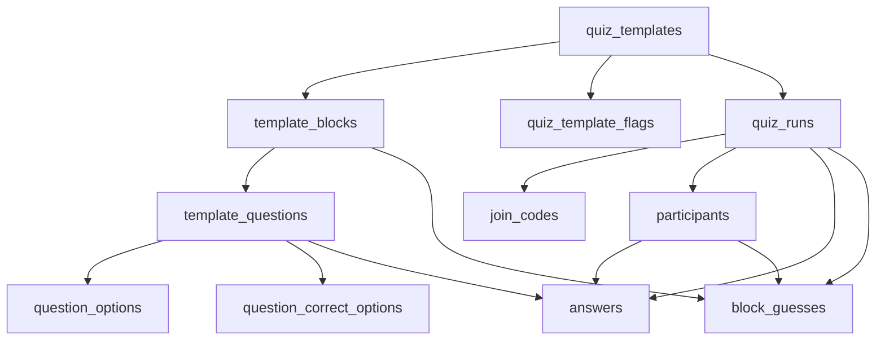

# Database & Backend Specification

This document specifies the recommended relational database structure, backend logic, and implementation patterns for the quiz game application. This serves as the authoritative specification for the new architecture.

**Status:** Specification (to be implemented)

---

## 1. Database Schema

### 1.1 Core Tables

#### Quiz Templates (Reusable Definition)

```sql
CREATE TABLE quiz_templates (
  id UUID PRIMARY KEY DEFAULT gen_random_uuid(),
  owner_user_id TEXT NOT NULL,
  name TEXT NOT NULL,
  max_questions_per_player INTEGER NOT NULL,
  min_questions_per_player INTEGER,
  suggested_questions_per_player INTEGER,
  enable_author_guessing BOOLEAN DEFAULT true,
  created_at TIMESTAMPTZ DEFAULT NOW(),
  updated_at TIMESTAMPTZ DEFAULT NOW()
);

CREATE INDEX idx_templates_owner ON quiz_templates(owner_user_id);
```

#### Quiz Runs (Play Instances)

```sql
CREATE TABLE quiz_runs (
  id UUID PRIMARY KEY DEFAULT gen_random_uuid(),
  template_id UUID REFERENCES quiz_templates(id) ON DELETE SET NULL,  -- Nullable for ad-hoc runs
  host_user_id TEXT NOT NULL,
  status TEXT NOT NULL CHECK (status IN ('CREATION', 'PLAY', 'FINISHED')),
  phase TEXT CHECK (phase IN ('QUESTION', 'AUTHOR_GUESS', 'AUTHOR_REVEAL', 'GRADING')),
  current_block_id UUID,  -- References template_blocks(id)
  current_question_id UUID,  -- References template_questions(id)
  started_at TIMESTAMPTZ,
  finished_at TIMESTAMPTZ,
  created_at TIMESTAMPTZ DEFAULT NOW(),
  updated_at TIMESTAMPTZ DEFAULT NOW()
);

CREATE INDEX idx_runs_template ON quiz_runs(template_id);
CREATE INDEX idx_runs_host ON quiz_runs(host_user_id);
CREATE INDEX idx_runs_status ON quiz_runs(status);
```

#### Join Codes (Separate from Quiz Identity)

```sql
CREATE TABLE join_codes (
  id UUID PRIMARY KEY DEFAULT gen_random_uuid(),
  code TEXT UNIQUE NOT NULL,  -- 6-char code
  quiz_run_id UUID NOT NULL REFERENCES quiz_runs(id) ON DELETE CASCADE,
  expires_at TIMESTAMPTZ NOT NULL,
  revoked_at TIMESTAMPTZ,
  created_at TIMESTAMPTZ DEFAULT NOW()
);

CREATE INDEX idx_join_codes_code ON join_codes(code);
CREATE INDEX idx_join_codes_run ON join_codes(quiz_run_id);
CREATE INDEX idx_join_codes_expires ON join_codes(expires_at);
```

### 1.2 Template Content Tables

#### Template Blocks

```sql
CREATE TABLE template_blocks (
  id UUID PRIMARY KEY DEFAULT gen_random_uuid(),
  template_id UUID NOT NULL REFERENCES quiz_templates(id) ON DELETE CASCADE,
  author_type TEXT NOT NULL CHECK (author_type IN ('host', 'player')),
  author_participant_id UUID,  -- Null for host blocks, set when player creates block in template
  title TEXT NOT NULL,
  order_index INTEGER NOT NULL,
  is_locked BOOLEAN DEFAULT false,
  created_at TIMESTAMPTZ DEFAULT NOW(),
  UNIQUE(template_id, order_index)
);

CREATE INDEX idx_template_blocks_template ON template_blocks(template_id);
CREATE INDEX idx_template_blocks_order ON template_blocks(template_id, order_index);
```

#### Template Questions

```sql
CREATE TABLE template_questions (
  id UUID PRIMARY KEY DEFAULT gen_random_uuid(),
  block_id UUID NOT NULL REFERENCES template_blocks(id) ON DELETE CASCADE,
  index_in_block INTEGER NOT NULL,
  text TEXT NOT NULL,
  type TEXT NOT NULL CHECK (type IN ('open', 'mcq')),
  correct_text TEXT,  -- For open questions: the correct answer text
  image_url TEXT,
  hint_text TEXT,  -- Future: hint for players
  points_correct INTEGER NOT NULL DEFAULT 1,  -- Future: variable points
  points_incorrect INTEGER NOT NULL DEFAULT 0,  -- Future: penalty points
  points_author_guess INTEGER NOT NULL DEFAULT 1,  -- Future: points for correct author guess
  created_at TIMESTAMPTZ DEFAULT NOW(),
  UNIQUE(block_id, index_in_block)
);

CREATE INDEX idx_template_questions_block ON template_questions(block_id);
CREATE INDEX idx_template_questions_block_order ON template_questions(block_id, index_in_block);
```

#### Question Options (MCQ Options, No JSONB)

```sql
CREATE TABLE question_options (
  id UUID PRIMARY KEY DEFAULT gen_random_uuid(),
  question_id UUID NOT NULL REFERENCES template_questions(id) ON DELETE CASCADE,
  index_in_question INTEGER NOT NULL,
  text TEXT NOT NULL,
  created_at TIMESTAMPTZ DEFAULT NOW(),
  UNIQUE(question_id, index_in_question)
);

CREATE INDEX idx_options_question ON question_options(question_id);
CREATE INDEX idx_options_question_order ON question_options(question_id, index_in_question);
```

#### Question Correct Options (Multi-Correct Support)

```sql
CREATE TABLE question_correct_options (
  question_id UUID NOT NULL REFERENCES template_questions(id) ON DELETE CASCADE,
  option_id UUID NOT NULL REFERENCES question_options(id) ON DELETE CASCADE,
  PRIMARY KEY (question_id, option_id)
);

CREATE INDEX idx_correct_options_question ON question_correct_options(question_id);
CREATE INDEX idx_correct_options_option ON question_correct_options(option_id);
```

#### Template Flags (Rare/Experimental Settings, No JSONB)

```sql
CREATE TABLE quiz_template_flags (
  template_id UUID NOT NULL REFERENCES quiz_templates(id) ON DELETE CASCADE,
  flag_key TEXT NOT NULL,
  enabled BOOLEAN NOT NULL DEFAULT true,
  PRIMARY KEY (template_id, flag_key)
);

CREATE INDEX idx_template_flags_template ON quiz_template_flags(template_id);
```

### 1.3 Run-Time Data Tables

#### Participants

```sql
CREATE TABLE participants (
  id UUID PRIMARY KEY DEFAULT gen_random_uuid(),
  quiz_run_id UUID NOT NULL REFERENCES quiz_runs(id) ON DELETE CASCADE,
  user_id TEXT,  -- Optional Supabase auth user ID
  display_name TEXT NOT NULL,
  player_token TEXT NOT NULL,  -- Device token for rejoin
  created_at TIMESTAMPTZ DEFAULT NOW(),
  UNIQUE(quiz_run_id, player_token),
  UNIQUE(quiz_run_id, LOWER(TRIM(display_name)))  -- Prevent duplicate names
);

CREATE INDEX idx_participants_run ON participants(quiz_run_id);
CREATE INDEX idx_participants_token ON participants(player_token);
```

#### Answers

```sql
CREATE TABLE answers (
  id UUID PRIMARY KEY DEFAULT gen_random_uuid(),
  quiz_run_id UUID NOT NULL REFERENCES quiz_runs(id) ON DELETE CASCADE,
  question_id UUID NOT NULL REFERENCES template_questions(id) ON DELETE CASCADE,
  participant_id UUID NOT NULL REFERENCES participants(id) ON DELETE CASCADE,
  answer_text TEXT NOT NULL,
  is_correct BOOLEAN,  -- null until graded for open questions
  created_at TIMESTAMPTZ DEFAULT NOW(),
  updated_at TIMESTAMPTZ DEFAULT NOW(),
  UNIQUE(question_id, participant_id)  -- One answer per question per player
);

CREATE INDEX idx_answers_run ON answers(quiz_run_id);
CREATE INDEX idx_answers_question ON answers(question_id);
CREATE INDEX idx_answers_participant ON answers(participant_id);
```

#### Block Guesses

```sql
CREATE TABLE block_guesses (
  id UUID PRIMARY KEY DEFAULT gen_random_uuid(),
  quiz_run_id UUID NOT NULL REFERENCES quiz_runs(id) ON DELETE CASCADE,
  block_id UUID NOT NULL REFERENCES template_blocks(id) ON DELETE CASCADE,
  guesser_participant_id UUID NOT NULL REFERENCES participants(id) ON DELETE CASCADE,
  guessed_participant_id UUID NOT NULL REFERENCES participants(id) ON DELETE CASCADE,
  is_correct BOOLEAN,
  created_at TIMESTAMPTZ DEFAULT NOW(),
  UNIQUE(block_id, guesser_participant_id)  -- One guess per block per player
);

CREATE INDEX idx_guesses_run ON block_guesses(quiz_run_id);
CREATE INDEX idx_guesses_block ON block_guesses(block_id);
CREATE INDEX idx_guesses_guesser ON block_guesses(guesser_participant_id);
```

---

## 2. Key Design Decisions

### 2.1 No JSONB

All data is stored in proper relational tables:
- MCQ options → `question_options` table (not JSONB array)
- Settings → explicit columns + `quiz_template_flags` table (not JSONB object)
- Enables efficient queries, indexes, and referential integrity

### 2.2 Template vs Run Separation

**Template Entities (Reusable Content):**
- `quiz_templates` - Quiz definition with settings
- `template_blocks` - Blocks that belong to the template
- `template_questions` - Questions that belong to template blocks
- `question_options` - MCQ options for template questions
- `question_correct_options` - Correct options for template questions
- `quiz_template_flags` - Rare/experimental settings

**Run Entities (Play Instance Data):**
- `quiz_runs` - A single play instance (status, phase, timestamps)
- `join_codes` - Maps codes → `quiz_runs.id` (with expiry/revocation)
- `participants` - Players who joined this run
- `answers` - Answers submitted in this run
- `block_guesses` - Author guesses made in this run

**Benefits:**
- History preserved per run (replay doesn't overwrite data)
- Easy "play again" by creating new run from template
- Analytics across multiple runs of the same template

### 2.3 Join Codes Separate from Identity

- Join codes are in `join_codes` table, not quiz identity
- Codes map to `quiz_run_id` (UUID), not directly to quiz
- Codes can expire (`expires_at`) and be revoked (`revoked_at`)
- Quiz identity is always UUID, codes are ephemeral

### 2.4 Correctness Source Model

**MCQ Questions (`type='mcq'`):**
- Correctness from `question_correct_options` table
- Supports multiple correct answers (multiple rows)
- No `correct_text` used for MCQ

**Open Questions (`type='open'`):**
- Correctness from `template_questions.correct_text`
- Contains expected answer text
- No rows in `question_correct_options` for open questions

**Database Enforcement:** See Section 3.1 for constraint triggers.

---

## 3. Database Constraints & Triggers

### 3.1 Correctness Source Enforcement

Enforce correctness source rules via Postgres trigger:

```sql
CREATE OR REPLACE FUNCTION enforce_correctness_source()
RETURNS TRIGGER AS $$
BEGIN
  IF NEW.type = 'mcq' THEN
    -- MCQ must have at least one correct option
    IF NOT EXISTS (
      SELECT 1 FROM question_correct_options 
      WHERE question_id = NEW.id
    ) THEN
      RAISE EXCEPTION 'MCQ question must have at least one correct option';
    END IF;
    -- MCQ should not have correct_text set
    IF NEW.correct_text IS NOT NULL THEN
      RAISE EXCEPTION 'MCQ question cannot have correct_text';
    END IF;
  ELSIF NEW.type = 'open' THEN
    -- Open must have correct_text
    IF NEW.correct_text IS NULL OR TRIM(NEW.correct_text) = '' THEN
      RAISE EXCEPTION 'Open question must have correct_text';
    END IF;
    -- Open should not have correct options
    IF EXISTS (
      SELECT 1 FROM question_correct_options 
      WHERE question_id = NEW.id
    ) THEN
      RAISE EXCEPTION 'Open question cannot have correct options';
    END IF;
  END IF;
  RETURN NEW;
END;
$$ LANGUAGE plpgsql;

CREATE TRIGGER check_correctness_source
  AFTER INSERT OR UPDATE ON template_questions
  FOR EACH ROW
  EXECUTE FUNCTION enforce_correctness_source();
```

---

## 4. Architecture Diagram



---

## 5. Settings Management

### 5.1 Explicit Columns (Common Settings)

Frequently used settings are explicit columns on `quiz_templates`:
- `max_questions_per_player`
- `min_questions_per_player`
- `suggested_questions_per_player`
- `enable_author_guessing`

**Benefits:** Fast queries, type-safe, indexed.

### 5.2 Flags Table (Rare/Experimental Settings)

For rare toggles, use `quiz_template_flags`:
- `flag_key` (e.g., 'enable_hints', 'strict_timing', 'beta_scoring')
- `enabled` (boolean)

**Decision Rule:**
- Single value, frequently queried → explicit column
- Single value, rarely queried → flags table
- Multiple values / list → dedicated table (not JSONB)

---

## 6. Future Schema Extensions

### 6.1 Decision Rules

1. **Single Value → Column**: `hint_text`, `points_correct`, `time_limit_seconds`
2. **Repeatable List → Table**: Multiple hints, multiple media assets
3. **Enum Values**: Stable/small → ENUM or CHECK, Growing → lookup table

### 6.2 Hints (Example Evolution)

**Phase 1: Column**
```sql
ALTER TABLE template_questions 
ADD COLUMN hint_text TEXT,
ADD COLUMN hint_reveal_mode TEXT CHECK (hint_reveal_mode IN ('manual', 'after_seconds', 'after_attempt')),
ADD COLUMN hint_reveal_after_seconds INTEGER;
```

**Phase 2: Table (if multiple hints needed)**
```sql
CREATE TABLE question_hints (
  id UUID PRIMARY KEY DEFAULT gen_random_uuid(),
  question_id UUID NOT NULL REFERENCES template_questions(id) ON DELETE CASCADE,
  index INTEGER NOT NULL,
  text TEXT NOT NULL,
  reveal_mode TEXT NOT NULL,
  reveal_after_seconds INTEGER,
  UNIQUE(question_id, index)
);
```

### 6.3 Variable Points

Already in schema:
- `points_correct` (default 1)
- `points_incorrect` (default 0, can be negative)
- `points_author_guess` (default 1)

**Scoring Views:** See Section 7.3

### 6.4 Open Answer Matching (Future)

```sql
ALTER TABLE template_questions
ADD COLUMN open_match_mode TEXT CHECK (open_match_mode IN ('exact', 'case_insensitive', 'contains', 'regex', 'manual_only')) DEFAULT 'exact',
ADD COLUMN open_answer_pattern TEXT;  -- For regex mode
```

---

## 7. Scoring & Views

### 7.1 Answer Points View

```sql
CREATE VIEW answer_points AS
SELECT 
  a.id AS answer_id,
  a.quiz_run_id,
  a.participant_id,
  a.question_id,
  CASE 
    WHEN a.is_correct = true THEN q.points_correct
    WHEN a.is_correct = false THEN q.points_incorrect
    ELSE 0  -- Not graded yet
  END AS points
FROM answers a
JOIN template_questions q ON a.question_id = q.id;
```

### 7.2 Guess Points View

```sql
CREATE VIEW guess_points AS
SELECT 
  g.id AS guess_id,
  g.quiz_run_id,
  g.guesser_participant_id,
  CASE 
    WHEN g.is_correct = true THEN 
      (SELECT points_author_guess FROM template_questions q 
       JOIN template_blocks b ON q.block_id = b.id 
       WHERE b.id = g.block_id LIMIT 1)
    ELSE 0
  END AS points
FROM block_guesses g;
```

### 7.3 Participant Scores View

```sql
CREATE VIEW participant_scores AS
SELECT 
  p.quiz_run_id,
  p.id AS participant_id,
  COALESCE(SUM(ap.points), 0) + COALESCE(SUM(gp.points), 0) AS total_score
FROM participants p
LEFT JOIN answer_points ap ON p.id = ap.participant_id
LEFT JOIN guess_points gp ON p.id = gp.guesser_participant_id
GROUP BY p.quiz_run_id, p.id;
```

**Benefits:**
- Scoring logic in SQL (backendless)
- Clients can query views directly (with RLS)
- Easy to adjust point values per question

---

## 8. Backend Implementation Patterns

### 8.1 Join Code Lookup

**Pattern:** Always lookup join code first, then use `quiz_run_id` for all operations.

```typescript
// Lookup join code
const { data: joinCode } = await supabase
  .from('join_codes')
  .select('quiz_run_id, expires_at, revoked_at')
  .eq('code', code)
  .single();

if (!joinCode || joinCode.revoked_at || new Date(joinCode.expires_at) < new Date()) {
  throw new Error('Invalid or expired join code');
}

const quizRunId = joinCode.quiz_run_id;
```

### 8.2 Fetching Quiz State

```typescript
// 1. Get quiz run
const { data: quizRun } = await supabase
  .from('quiz_runs')
  .select('*, template:quiz_templates(*)')
  .eq('id', quizRunId)
  .single();

// 2. Get template content (blocks, questions, options)
const { data: blocks } = await supabase
  .from('template_blocks')
  .select('*')
  .eq('template_id', quizRun.template_id)
  .order('order_index');

const { data: questions } = await supabase
  .from('template_questions')
  .select(`
    *,
    options:question_options(*),
    correct_options:question_correct_options(option:question_options(*))
  `)
  .in('block_id', blocks.map(b => b.id))
  .order('block_id, index_in_block');

// 3. Get run-time data (participants, answers, guesses)
const { data: participants } = await supabase
  .from('participants')
  .select('*')
  .eq('quiz_run_id', quizRunId);

const { data: answers } = await supabase
  .from('answers')
  .select('*')
  .eq('quiz_run_id', quizRunId);

const { data: guesses } = await supabase
  .from('block_guesses')
  .select('*')
  .eq('quiz_run_id', quizRunId);
```

### 8.3 Creating Quiz Run

```typescript
// Create quiz run from template
const { data: quizRun, error } = await supabase
  .from('quiz_runs')
  .insert({
    template_id: templateId,
    host_user_id: hostUserId,
    status: 'CREATION'
  })
  .select()
  .single();

// Generate and store join code
const code = generateJoinCode(); // 6-char code
const expiresAt = new Date(Date.now() + 4 * 60 * 60 * 1000); // 4 hours

await supabase
  .from('join_codes')
  .insert({
    code,
    quiz_run_id: quizRun.id,
    expires_at: expiresAt.toISOString()
  });
```

### 8.4 Submitting Answer (Transaction)

```typescript
// Use transaction to prevent race conditions
const { data: existing } = await supabase
  .from('answers')
  .select('id')
  .eq('question_id', questionId)
  .eq('participant_id', participantId)
  .single();

if (existing) {
  // Update existing answer
  await supabase
    .from('answers')
    .update({ answer_text: answerText, updated_at: new Date().toISOString() })
    .eq('id', existing.id);
} else {
  // Insert new answer
  await supabase
    .from('answers')
    .insert({
      quiz_run_id: quizRunId,
      question_id: questionId,
      participant_id: participantId,
      answer_text: answerText
    });
}
```

---

## 9. API Design

### 9.1 Endpoint Patterns

**Join Code Validation:**
- All endpoints that accept join codes must validate expiry/revocation
- Return `quiz_run_id` after validation for internal use

**State Fetching:**
- Support partial state queries (e.g., "just answers for question X")
- Use joins to fetch related data efficiently
- Return template content separately from run-time data

**Mutations:**
- Use transactions for multi-step operations
- Handle constraint violations gracefully
- Return clear error messages

### 9.2 Client Integration

**Option A: Direct Supabase Queries (Reads)**
- Clients query Supabase directly for read-only operations
- Requires RLS configuration
- Faster, less server load

**Option B: Always Through Edge Function**
- All operations go through Edge Function
- Consistent, enforces business logic
- Adds latency

**Option C: Hybrid (Recommended)**
- Reads: Direct Supabase queries (with RLS)
- Writes: Through Edge Function
- Join code lookup: Always server-side

---

## 10. Migration Strategy

### 10.1 Data Migration

**Option: Dual-Write Period**
1. Write to both KV and relational during transition
2. Read from relational (new quizzes) or KV (old quizzes)
3. Gradually migrate old quizzes
4. Eventually deprecate KV reads

### 10.2 Backward Compatibility

**Strategy: Keep API Shape, Change Backend**
- Edge Function reads from relational DB
- Returns same JSON structure
- Clients don't need changes
- Minimal disruption

---

## 11. Implementation Priority

### Phase 1: Critical Fixes
1. ✅ Event-driven updates (Supabase Realtime)
2. ✅ Rejoin flow fixes
3. ⚠️ Partial state queries

### Phase 2: Data Structure Migration
1. ⚠️ Create relational tables
2. ⚠️ Implement join code lookup
3. ⚠️ Migrate Edge Function to use relational queries
4. ⚠️ Add database constraints and triggers

### Phase 3: Optimization
1. ⚠️ Implement scoring views
2. ⚠️ Add RLS policies
3. ⚠️ Optimize queries with indexes

---

## 12. Open Questions

### 12.1 API Architecture
**Question:** Should clients query Supabase directly or always go through Edge Function?

**Recommendation:** Hybrid - Reads direct (with RLS), writes through Edge Function.

### 12.2 State Fetching Strategy
**Question:** How should clients fetch quiz state?

**Recommendation:** Event-driven + partial queries with Supabase Realtime subscriptions.

### 12.3 Player Identity
**Question:** How should player tokens be managed?

**Recommendation:** Keep current approach (anonymous tokens) with indexed `player_token` column.

### 12.4 Image Storage
**Question:** Keep Supabase Storage?

**Recommendation:** Yes, unless performance issues arise.

---

## Summary

This specification defines:

- **Relational schema** with no JSONB
- **Template/run separation** for replay capability
- **Join codes** as separate entity with expiry
- **Correctness source** enforcement via database constraints
- **Settings management** via explicit columns + flags table
- **Future-proofing** patterns for schema evolution
- **Scoring views** for backendless computation
- **Backend patterns** for common operations

This architecture addresses all problems identified in `current-architecture-analysis.md` and provides a scalable, maintainable foundation for the quiz game application.

